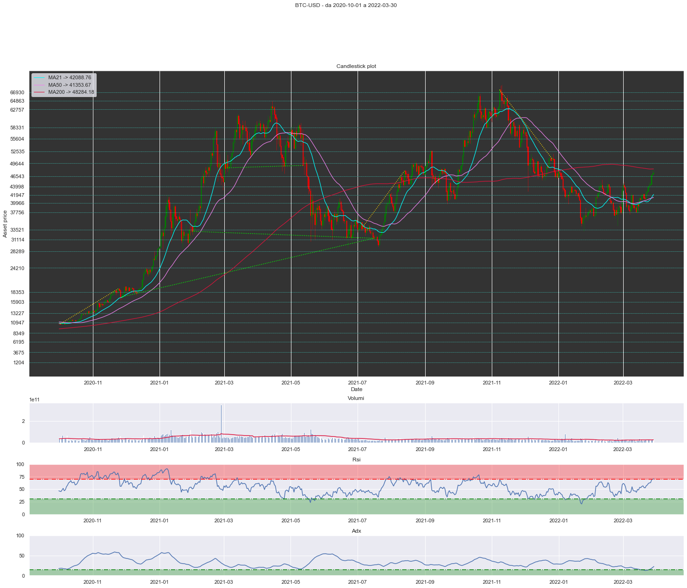
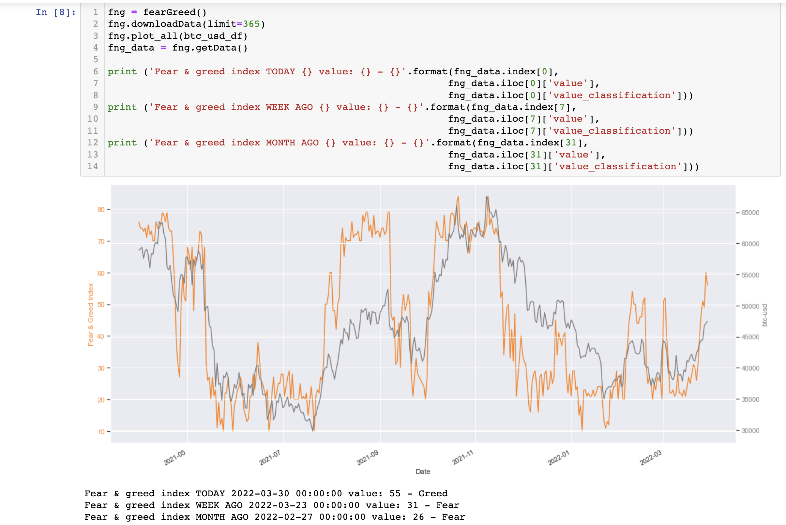
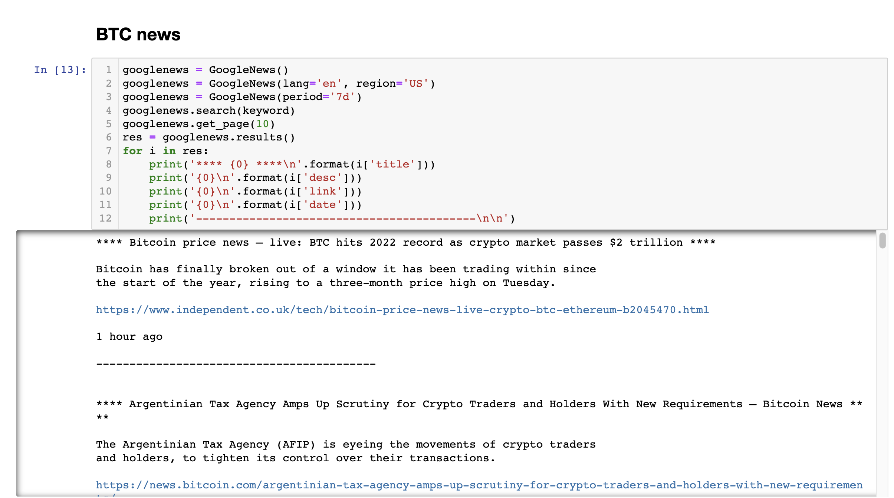
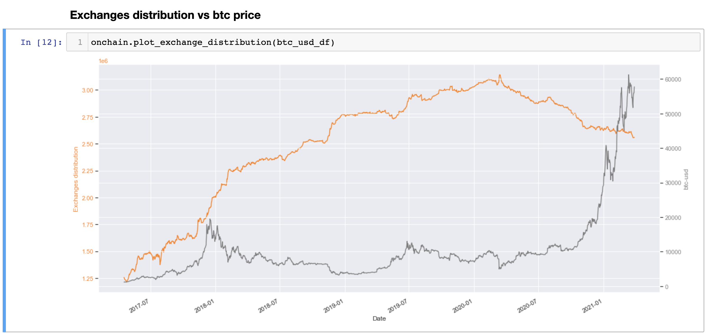

# Bitcoin dashboard

Staying informed about Bitcoin can be time-consuming because helpful information is scattered across different sites.

* Tradingview for technical analysis
* Glassnode for on-chain analysis
* fear & Greed index
* etc ...

The dashboard idea aims to collect the pieces of information in one place, with the double advantage of saving time and maintaining control of the data to be analyzed.

The dashboard displays:
* Technical analysis (MA21, MA50, MA200, automatic supports and resistances, RSI, ADX, volumes)
* Bitcoin performance
* Bitcoin correlation with S&P 500 and gold 
* On-chain analysis (hashrate, exchanges distribution)
* Fear & greed vs price
* Vix vs price
* Newsreader

## Gallery







## Requirements
1. Install [Python 3](https://www.python.org/downloads/) and clone the code
```bash
git clone https://github.com/cardano-on-the-road/bitcoin-dashboard.git
```
2. Create a virtual env 
```bash
python3 -m venv venv 
```

3. Activate the environment
```bash
source venv/bin/activate  
```

4. Install Jupyter notebook
```bash
pip install jupyter 
```

5. Run Jupyter notebook
```bash
cd ./bitcoin-dashboard
jupyter notebook
```


